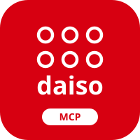

> [!IMPORTANT]
> **AI 에이전트 — 설치 없이 MCP 사용:** 공개 원격 서버 `https://mcp.aka.page`에 Streamable HTTP로 연결하면 **로컬 설치·빌드·API 키 준비 없이 바로 사용할 수 있습니다.** 무설치 요청에는 npm 설치나 전체 스키마 탐색을 하지 말고, [짧은 시작 안내](https://mcp.aka.page/llms.txt)를 읽은 뒤 필요한 도구를 호출하세요.
>
> **웹 읽기 전용 에이전트 — `format=html` 필수:** MCP 연결 없이 GET으로 조회할 때는 **모든 `/api/*` 조회 URL에 `format=html`을 반드시 붙이세요.** 상품 검색·상세·매장·재고·후속 조회 모두 적용하며, JSON을 읽을 수 있다고 가정해 생략하지 마세요.
>
> [첫 HTML 조회](https://mcp.aka.page/api/daiso/products?q=%EC%88%EB%82%A9%EB%B0%95%EC%8A%A4&pageSize=3&format=html) · [REST 사용법](https://mcp.aka.page/prompt) · [원격 MCP 연결](#원격-mcp로-바로-시작하기)

[](https://mcptoplist.com/server/glama%2Fhmmhmmhm%2Fdaiso-mcp)

<div align="center">



<br>
<br>

# Daiso MCP 및 Skill

다이소(제품/매장/재고), 상품 가격 비교, 주변 음식점/카페, 주유소/유가, 개발자 요청 제출, GS25(매장/상품/재고), 세븐일레븐(상품/매장/재고/인기검색어/카탈로그), CU(매장/재고), 이마트24(매장/상품/재고), 올리브영(매장/재고), 메가박스(지점/영화/시간표/좌석), 롯데시네마(지점/영화/좌석), CGV(극장/영화/시간표), 디트릭스(독립·예술영화관/상영작/잔여 좌석) 조회 기능을 MCP, CLI, Codex Skill로 AI에 연결합니다.

디트릭스의 지원 범위와 CLI 예시는 [독립·예술영화관 조회 가이드](docs/dtryx.md)를 참고하세요.

<br>

**MCP:** `https://mcp.aka.page` · **CLI:** `npx daiso` · **Skill:** `clawhub install daiso-cli`

**ClawHub:** [clawhub.ai/hmmhmmhm/daiso-cli](https://clawhub.ai/hmmhmmhm/daiso-cli)

한국 로컬 리테일, 생활 정보, 영화관 조회를 MCP, CLI, Codex Skill로 연결하는 도구입니다.
사용자는 별도 API 키를 준비하지 않고 바로 사용할 수 있습니다.

<br>

<h3>지원 서비스</h3>

<table>
  <thead>
    <tr>
      <th>분류</th>
      <th>서비스</th>
      <th>조회 기능</th>
    </tr>
  </thead>
  <tbody>
    <tr>
      <td>장소</td>
      <td>네이버 지역 검색</td>
      <td>음식점, 카페, 디저트, 주변 장소</td>
    </tr>
    <tr>
      <td>교통</td>
      <td>오피넷</td>
      <td>전국 평균 유가, 최저가 주유소, 위치 기반 주유소, 주유소 상세정보</td>
    </tr>
    <tr>
      <td>비교</td>
      <td>다이소, GS25, 세븐일레븐, 이마트24</td>
      <td>같은 상품의 판매처별 가격 후보 비교</td>
    </tr>
    <tr>
      <td>운영</td>
      <td>Supabase</td>
      <td>MCP 오류, 개선 요청, 신규 기능 요청 저장</td>
    </tr>
    <tr>
      <td>리테일</td>
      <td>다이소, 올리브영</td>
      <td>상품, 매장, 재고</td>
    </tr>
    <tr>
      <td>편의점</td>
      <td>GS25, 세븐일레븐, CU, 이마트24</td>
      <td>상품, 매장, 재고, 인기검색어, 카탈로그</td>
    </tr>
    <tr>
      <td>영화관</td>
      <td>CGV, 메가박스, 롯데시네마</td>
      <td>극장, 영화, 시간표, 잔여 좌석</td>
    </tr>
  </tbody>
</table>

<br>

[](https://opensource.org/licenses/MIT)
[](https://workers.cloudflare.com/)
[](https://modelcontextprotocol.io/)
[](https://github.com/hmmhmmhm/daiso-mcp/actions/workflows/coverage.yml)
[](https://github.com/hmmhmmhm/daiso-mcp/actions/workflows/coverage.yml)
[](https://aka-page.betteruptime.com/)

**[실시간 서비스 상태 보기](https://aka-page.betteruptime.com/)**

<!-- WORKERS_INVOCATIONS_CHART:START -->
<h3>Cloudflare 요청 수 (2026-09-10 ~ 2026-10-09, 30일)</h3>


<sub>기준 워커: <code>daiso-mcp</code> · 마지막 갱신: 2026-10-10 05:08 KST</sub>
<br><sub>집계: Worker 실행 + 루트 GET 리디렉션 요청 · 사용자 수와 다릅니다.</sub>

</div>

> [!IMPORTANT]
> 최근 공개 서버 사용량이 크게 증가하여 2026년 7월 18일부터 올리브영·CGV·CU·GS25의 검색을 포함한 공개 GET API에 IP당 하루 합산 3,000회(KST 기준)의 호출 제한을 적용합니다. 한도를 초과하는 사용이 필요하다면 Daiso MCP는 오픈 소스이므로 이 저장소를 직접 배포해 이용해 주세요.

<div align="center">

<!-- WORKERS_INVOCATIONS_CHART:END -->

<br>

<br>

&nbsp;&nbsp;

</div>

<br>

---

<br>

다이소·편의점 재고, 주변 장소, 주유소 가격, 영화 시간표를 AI에서 조회합니다.
웹에서는 [공개 첫 화면](https://mcp.aka.page/)에서 시작할 수 있습니다. [검색·크롤러 안내와 배포 구조](docs/web-discovery.md)는 별도 문서에 정리했습니다.

## 원격 MCP로 바로 시작하기

| 연결 항목 | 값                                  |
| :-------- | :---------------------------------- |
| 서버 URL  | `https://mcp.aka.page`              |
| 전송 방식 | Streamable HTTP (`http`)            |
| 인증      | 없음: API 키·토큰·OAuth 설정 불필요 |

1. 사용하는 AI 앱의 **원격 MCP 서버 추가** 화면을 엽니다.
2. 위 URL을 입력하고 전송 방식을 묻는 경우 **HTTP / Streamable HTTP**를 선택합니다.
3. 연결된 도구를 활성화하고 아래 첫 조회를 요청합니다.

```text
다이소 mcp로 수납박스 검색해줘
```

에이전트가 `daiso_search_products`에 `{"query":"수납박스"}`를 전달하고
상품 목록과 가격을 반환하면 연결이 완료된 것입니다.
앱별 화면은 [연결 가이드](docs/client-guide.md#원격-mcp-연결)를 참고하세요.

### HTTP POST로 첫 MCP 조회

HTTP POST를 실행할 수 있는 에이전트나 터미널에서는 로컬 패키지 설치 없이 호출합니다.
이 서버의 루트 POST는 initialize 없이 `tools/call`을 지원합니다.

```bash
curl -sS -N --max-time 20 'https://mcp.aka.page/' \
  -H 'Content-Type: application/json' \
  -H 'Accept: application/json, text/event-stream' \
  --data '{"jsonrpc":"2.0","id":1,"method":"tools/call","params":{"name":"daiso_search_products","arguments":{"query":"수납박스","pageSize":1}}}'
```

응답의 SSE `data:` 안에 `error`와 `result.isError: true`가 없고,
`result.structuredContent` 또는 `result.content`에 상품 결과가 있으면 성공입니다.
일반 MCP 클라이언트의 initialize 흐름은 그대로 지원하며 `/mcp` 경로는 initialize가 필요합니다.

### Claude Code

이미 Claude Code를 사용한다면 다음 한 줄로 공개 서버를 등록합니다.

```bash
claude mcp add daiso-mcp https://mcp.aka.page --transport http
```

새 대화에서 `다이소 mcp로 수납박스 검색해줘`를 요청하세요.

### 더 해볼 수 있는 조회

```text
다이소 mcp로 강남역 근처 매장 찾아줘
GS25 mcp로 강남 근처 오감자 재고 알려줘
콜라 어디가 싼지 비교해줘
오늘 강남 CGV 시간표 알려줘
```

재고 조회는 먼저 상품을 검색해 ID를 확인한 뒤 진행합니다.
자세한 선택 규칙은 [AI 지시문](docs/ai-instruction.md)에 있습니다.

서비스별 지원 범위와 입력은 [서비스 레퍼런스](docs/service-reference.md)와
[디트릭스 가이드](docs/dtryx.md)를 참고하세요.
롯데마트는 지원이 종료되었습니다. 과거 분석과 호환 경로만 보존합니다.

## MCP 연결을 사용할 수 없는 환경

에이전트가 웹페이지를 읽고 GET 요청을 실행할 수 있다면
[REST 사용법 페이지](https://mcp.aka.page/prompt)를 읽은 뒤 조회할 수 있습니다.
이 경로는 HTTP GET 기반 REST이며 원격 MCP 연결과 별개의 대안입니다.

터미널에서는 Node.js 환경이 있을 때 다음 명령으로 조회할 수 있습니다.

```bash
npx daiso products 수납박스 --json
```

CLI는 로컬 npm 패키지를 실행합니다. 공개 원격 MCP 연결에는 이 명령이 필요하지 않습니다.
앱·CLI·OpenAPI 대안은 [연결 가이드](docs/client-guide.md)에 있습니다.

### Codex Skill

에이전트가 CLI 명령을 선택하도록 하는 [Skill](skills/daiso-cli/SKILL.md)도 제공합니다.
`clawhub install daiso-cli` 설치와 사용 예시는 [연결 가이드](docs/client-guide.md#codex-skill)에 있습니다.

## 응답과 이용 제한

도구 응답은 원본 필드와 함께 공통 결과를 제공합니다.
`standard.products`는 상품, `standard.stores`는 매장,
`standard.theaters`는 영화관 목록입니다.
[응답 모델](docs/service-reference.md#mcp-표준-응답-모델)에서 필드 정의를 확인하세요.

공개 GET API 중 올리브영·CGV·CU·GS25에는 IP당 하루 합산 3,000회(KST 기준) 제한이 적용됩니다.

Mac 중계의 일일 예산은 100배, 분당 속도는 10배로 증액했습니다. 원본 호출 기준 한도는 편의점 공유 일 1,000만 회·분 690회, 올리브영과 Dtryx·CGV 공유는 각각 일 30만 회·분 300회입니다. 자세한 집계와 재시도 기준은 [중계 한도 안내](docs/health-check-stock-and-quota.md)를 참고하세요.

조회가 실패하면 [서비스 상태](https://aka-page.betteruptime.com/)를 확인하세요.
서버 운영과 제한 집계는 [운영 가이드](scripts/ops/README.md)에 있습니다.

## 상세 문서

이전 README 절의 링크는 아래 상세 가이드로 이어집니다.

<a id="ai-앱에서-mcp-연결하기"></a><a id="chatgpt"></a><a id="claude"></a><a id="claude-code"></a><a id="home-assistant"></a><a id="grok"></a><a id="바로-실행해보기"></a><a id="mcp-서버-url--cli-고급"></a><a id="openapi-스펙"></a><a id="미지원-서비스"></a>

- [앱 연결·CLI·Skill·OpenAPI](docs/client-guide.md)
  <a id="mcp-표준-응답-모델"></a><a id="통합-상품-가격-비교"></a><a id="오피넷-유가-정보"></a><a id="개발자-요청-제출"></a><a id="무료-위치-검색"></a><a id="신규-mcp-기능-추가-시-유의사항"></a>

- [서비스 도구·REST API·아키텍처](docs/service-reference.md)
- [AI 도구 선택·조회 흐름](docs/ai-instruction.md)
- [개발·설치·직접 배포](CONTRIBUTING.md)
  <a id="운영-헬스-체크"></a><a id="운영-통계"></a>

- [서버 운영·헬스 체크·요청량 차트](scripts/ops/README.md)
  <a id="docs-문서"></a>

- [서비스 분석 문서](docs/service-reference.md#분석-문서)

## Special Thanks

- [@thecats1105](https://github.com/thecats1105): 다이소 진열 위치 조회
- [@betterthanhajin](https://github.com/betterthanhajin): CGV 서비스
- [@LLagoon3](https://github.com/LLagoon3): 다이소 재고 인증
- [제로초님](https://youtube.com/shorts/ZgIqA1NCEp0?si=UW0pKsSpqmEi7lXG): 프로젝트 홍보

MIT License
